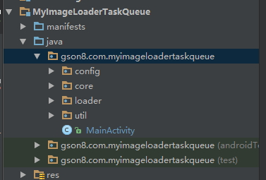
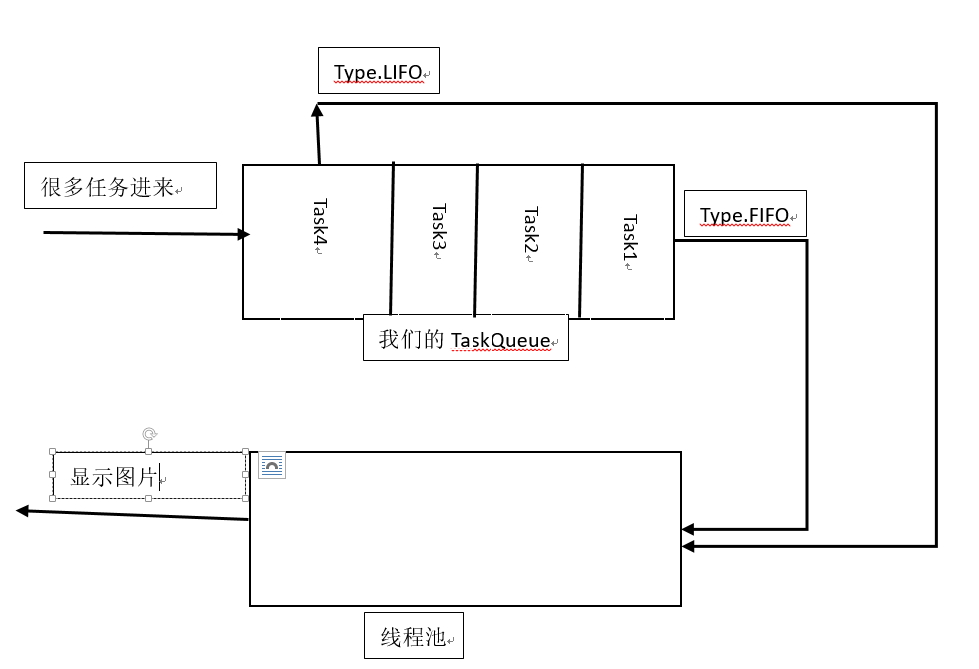
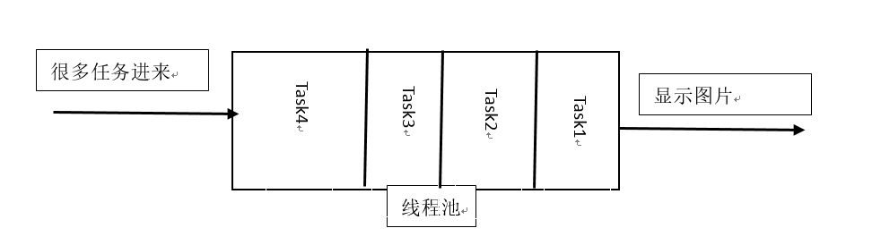

[TOC]

# 个人小型图片加载框架

## 1.MyImageLoader+TaskQueue版(LruCache&DiskLruCache)
`Folder:`** MyImageLoaderTaskQueue**

[源码地址,可直接用的](MyImageLoaderTaskQueue.rar)
### 结构

这里用到`LruCache`和`DiskLruCache`一起用了

用法:
```java

LoaderConfig config;

// this 这里为Context
config = new LoaderConfig(this);

config.setThreadCount(4).setDiskLruCacheSize(100).setLruCacheSize(50).setTaskType(LoaderConfig.TaskType.TYPE_LIFO);

MyImageLoader.getInstance(config).displayImage(imgUrl, ImagerView);


```
* `setThreadCount()`:设置线程池一次运行的个数
* `setDiskLruCacheSize()`: 磁盘缓存大小
* `setLruCacheSize()`:内存缓存大小
* `setTaskType()`:设置任务的顺序模式,有两种模式
	* `TYPE_LIFO`: 最后进来的任务先执行(栈)
	* `TYPE_FIFO`: 先进来的任务先执行(队列)

* `setDiskCacheFolder()`:设置磁盘缓存的路径,可以传入`String`,`File`类型的参数



**这个会用一个`TaskQueue`来管理线程,当线程池中有空的时候,就通知`TaskQueue`去取一个线程**
`Type.FIFO`:先来的线程先执行
`Type.LIFO`:后来的线程先执行


## 2.ImageLoader简易版(LruCache&DiskLruCache)
**这个相比第一个来说就是没有任务队列**
**只有线程池的的`内部队列`**

`LruCache`&`DiskLruCache`



`PS`:**当前这个中,所以的任务进来都只能按照进来的顺序反选,线程池在的线程执行完毕后会自动调用下一个等待的线程**

`Folder `:** App **
```java
 ImageLoader.getInstance(MainActivity.this)
                    .displayImage(holder.iv, list.get(position), null);
```


## 3.加载本地图片版(LruCache)
`Folder`:** ImoocImageLoader **


>Imooc 上的高仿微信图片选择器


# 注意
### // 在ListView/RecyclerView/GridView 加上这个可以避免图片的加载未完成时错位
```
//重点是这句. 重置图片的状态
holder.img.setImageResource(R.mipmap.ic_launcher);

ImageLoader.getInstance(4, ImageLoader.Type.LIFO)
        .loadImage(mDirPath + "/" + mImagPaths.get(position), holder.img);

```


